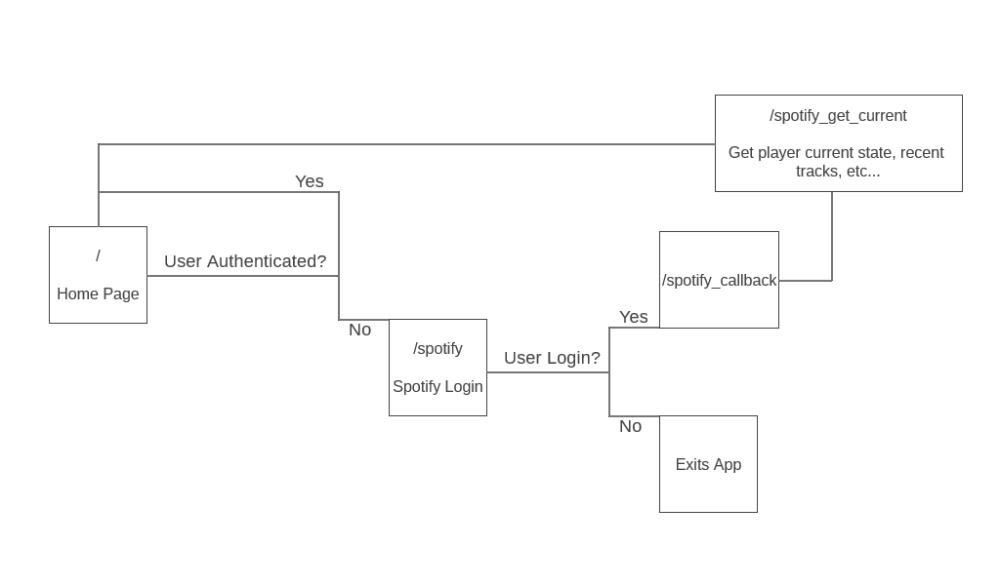
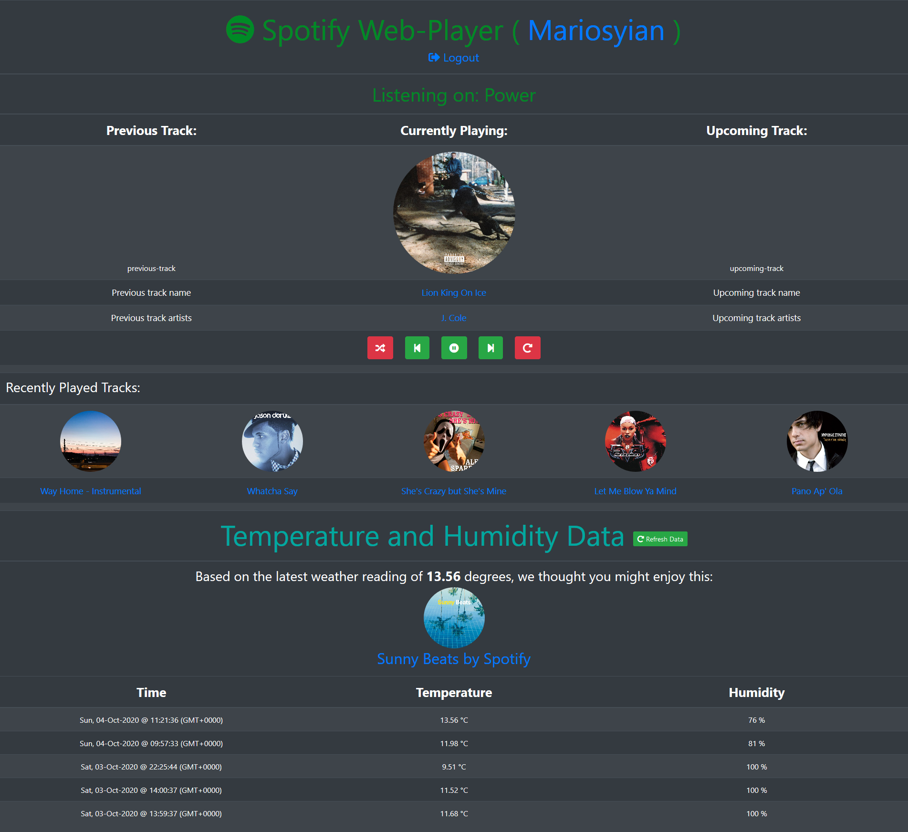

# About:
This project is for use as a personal hobby and to further explore use of databases, web development and the Python programming language. This project is open-source, so feel free to fork this repository and make it your own.

# Requirements (Alphabetically):
* Axios -- Version Used: v0.21.2
* Body-Parser -- Version Used: v1.19.0
* Dotenv -- Version Used: v8.2.0
* EJS -- Version Used: v3.1.5
* Express -- Version Used: v4.17.1
* Express-Session -- Version Used: v1.17.1
* Mongoose -- Version Used: v5.10.7
* Node.js -- Version Used: v16.13.1
* Nodemon -- Version Used: v2.0.4
* NPM -- Version Used: v8.1.2
* Passport-Local-Mongoose -- Version Used: v6.1.0
* Passport-Local -- Version Used: v1.0.0
* Passport -- Version Used: v0.4.1
* Query-String -- Version Used: v6.13.5
* Spotify-Web-Api-Node -- Version Used: v4.0.0
* Twilio -- Version Used: v3.57.0

# Usage:
**NOTE:** All API Keys and other sensitive information are kept inside a `.env` file (already placed in the `.gitignore` file).

Example `.env` configuration
```
HOME_URI=<The URL that your web app will be deployed to. Heroku is a good and free webapp host.>
MONGO_URL=<You can get this from your MongoDB Atlas dashboard>
SECRET=<Random string used for cookies. See 'express-session' npm package for more information>
OPENWEATHER_API_KEY=
TWILIO_SID=
TWILIO_AUTH_TOKEN=
TWILIO_PHONE_NUM_RECIPIENT=<Used to receive an SMS in case of (un)succesful logins>
TWILIO_PHONE_NUM_SENDER=<Used to send an SMS in case of (un)succesful logins>
SPOTIFY_CLIENT_ID=
SPOTIFY_SECRET_ID=
SPOTIFY_USER_ID=
```

Navigate to the root directory
```
npm install
npm start
```

# Project Idea:
Create a RaspberryPi program that will make use of the SenseHAT extension, in order to take weather readings such as temperature and humidity. These readings will work along the Spotify API to form a RaspberryPi Spotify Web Server, that plays different playlists, based on weather conditions.

This project is in very early stages so no screenshots or data exist. Hopefully this gets filled out with time.

01/06/2020: Deployed using Heroku service: https://raspi-spotify.herokuapp.com/

# Implementation:
## Spotify:
* Use of Spotify API
  * Allow for play / pause track
  * View currently playing track
  * Skip to previous / next track
  * Toggle repeat between off / context / track
  * Will append for:
    * volume control -- Spotify currently allows only for Desktop client support
    * device switching

## Weather Logging:
* <strike>Use of SenseHAT</strike> OpenWeather API for data gathering
* MongoDB for data storage and access
* <strike>Python and BeautifulSoup requests library to send data into website as live test</strike>

## WebPage:
* CSS and Bootstrap Framework for styling
* EJS for HTML templates (View Model)
* Heroku WebService to host NodeJS application online
* HTML for creating the page
* MongoDB and Mongoose framework for data storage
* Node.js and Express for back-end

# API:
This app is set to run on port 3000 or can be manually changed either in the source code or by introducing a `PORT` environment variable. It acts as an interface, to  directly communicate with the Spotify API.

In order to communicate with the API, an `Authorisation Token` is required. You can get one by visiting http://localhost:3000/

This redirects to Spotify's login page and asks access for the following permissions:
```
user-modify-playback-state
user-read-email
user-read-playback-state
user-read-private
user-read-recently-played
user-read-currently-playing
user-modify-playback-state
```

Once granted, the user now has an `Authorisation Token` valid for 1 hour. A `Refresh Token` is also returned which can be used to extend the current session. More information can be found on Spotify's Authorization Guide (https://developer.spotify.com/documentation/general/guides/authorization-guide/).

With the `Authorisation Token`, the user can now make requests to the API.

## Endpoints:
Name | Endpoint | Operations Supported
------------ | ------------- | -------------
Home Page | http://localhost:3000/ | GET
Logout | http://localhost:3000/logout | GET
Pause Track | http://localhost:3000/spotify_pause | GET
Play Track | http://localhost:3000/spotify_play | GET
Play / Pause Track | http://localhost:3000/spotify_play_pause | POST
Next Track | http://localhost:3000/spotify_next | POST
Previous Track | http://localhost:3000/spotify_previous | POST
Repeat Off / Context / Track | http://localhost:3000/spotify_repeat | POST
Shuffle Tracks | http://localhost:3000/spotify_shuffle | POST
Weather Data | http://localhost:3000/weather | GET

More endpoints exist such as `/error`, `/spotify`, `/spotify_callback` and `/spotify_get_current` which are not meant to be used by the user directly (see below chart).



# WebApp layout:


The WebApp has a simple interface that should already be familiar to most media players.

On the top is the applications name, along with the username of the currently logged in user (This links to their Spotify profile). Below is a hyperlink that redirects the user the logout endpoint, terminating their current session and `Authorisation Token`.

In the middle row, the currently playing track can be seen with links to the track and all its artists. The media buttons are read as follows:

 Shuffle is currently off

 Shuffle is currently on

 Skip to previous track

 Pressing the button will pause the current track

 Pressing the button will play the current track

 Skip to next track

 Repeat is currently off

 Repeat is currently on context state. Repeats entire queue.

 Repeat is currently on track state. Repeats currently playing track.

# Known-Issues:
* `/weather` endpoint returns 4xx error if the API call has not returned and the user requested again.
* Spamming any media button can cause unstable state in the application although the player (most of the times) responds to the given commands in order. This was tested with a decent internet connection (DL: 100Mbps, UP:90Mbps) and response times of 200-300ms for each command.
* Currently playing track sometimes shows the previous playing track (State discrepancy).
